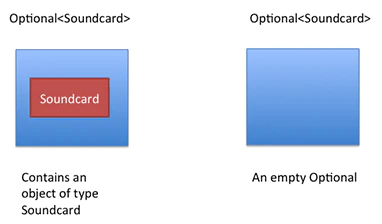

# Java 8 Sharing

* lambda expression
* stream API

## Why

### Declarative over imperative

Declarative programming: describing WHAT the program does, without explicitly specifying its control flow.  
  
Imperative programming: describing HOW the program should do something by 
+ explicitly specifying each instruction (or statement) step by step
+ mutate the program's state.

### Immutability over mutability

## Lambda expression

Example: Given a list of Integer numbers, return a list with each element is doubled

**Imperative**
```java
public static List<Integer> doubleMap(List<Integer> numbers) {
    List<Integer> newList = new ArrayList<>();
    for(Integer i : numbers) {
        Integer newNum = i * 2;
        newList.add(newNum);
    }

    return newList;
}
```

```java
public static List<Integer> squareMap(List<Integer> numbers) {
    List<Integer> newList = new ArrayList<>();
    for(Integer i : numbers) {
        Integer newNum = i * i;
        newList.add(newNum);
    }

    return newList;
}
```

**Declarative**

Not using lambda
```java
public static List<Integer> doubleMapOld(List<Integer> numbers) {
    return numbers.stream().map(new Function<Integer, Integer>() {
        @Override
        public Integer apply(Integer integer) {
            return integer * 2;
        }
    }).collect(Collectors.toList());
}
```

Using Lambda Expression
```java
public static List<Integer> doubleMapUsingLambda(List<Integer> numbers) {
        return numbers.stream().map(i -> {
            return i * 2;
        }).collect(Collectors.toList());
}
```

https://www.geeksforgeeks.org/lambda-expressions-java-8/

## Steam API

```java
public static List<Number> doubleNumber(List<Number> numbers) {
    for(int i = 0; i < numbers.size(); i++) {
        Integer number = numbers.get(i);
        numbers.set(i, number * 2);
    }

    return numbers;
}
```

```java
public static List<Integer> doubleMap(List<Integer> numbers) {
    List<Integer> newList = new ArrayList<>();
    for(Integer i : numbers) {
        newList.add(i * 2);
    }

    return newList;
}
```

Using Stream's mapping
```java
public static List<Integer> doubleUsingMap(List<Integer> numbers) {
    return numbers.stream().map(i -> i * 2).collect(Collectors.toList());
}
```

### Stream creations
```java
List<Integer> numbers = Arrays.asList(1, 2, 3);
Stream<Integer> stream = numbers.stream();
```

### Range
```java
IntStream intStream = IntStream.range(1, 3);
LongStream longStream = LongStream.rangeClosed(1, 3);
```

### Stream Operations
```
Stream Operations =  intermediate operations (return Stream<T>) + 
                     terminal operation (return a result of definite type).
```

**Intermediate operations**
* filter
* map
* ...

**Terminal operations**

* Matching
```java
boolean isValid = list.stream().anyMatch(element -> element.contains("h")); // true
boolean isValidOne = list.stream().allMatch(element -> element.contains("h")); // false
boolean isValidTwo = list.stream().noneMatch(element -> element.contains("h")); // false
```

* Collecting
```java
List<String> resultList 
  = list.stream().map(element -> element.toUpperCase()).collect(Collectors.toList());
```

* forEach

## Optional

### Why

```java
String version = computer.getSoundcard().getVersion();
```



### Creating Optional object

To create an empty Optional
```java
Optional<String> empty = Optional.empty();

```
an Optional with a non-null value:
```java
Optional<Soundcard> sc = Optional.of(soundcard);
// NullPointerException will be thrown if argument is null
```

in case we expect some null values, we can use the ofNullable() method:
```java
Optional<String> opt = Optional.ofNullable(name);
```

### Checking Value Present
```java
Optional<String> opt = Optional.of("Baeldung");
assertTrue(opt.isPresent());

opt = Optional.ofNullable(null);
assertFalse(opt.isPresent());
```

### Do Something If a Value Is Present

```java
Optional<String> opt = Optional.of("hello");
opt.ifPresent(name -> System.out.println(name.length()));
```

### Default Value With orElseGet()

```java
String nullName = null;
String name = Optional.ofNullable(nullName).orElseGet(() -> "john");
```

###  Exceptions With orElseThrow()
```java
String nullName = null;
    String name = Optional.ofNullable(nullName).orElseThrow(
      IllegalArgumentException::new);
```
### Returning Value With get()
```
Optional<String> opt = Optional.of("hello");
String name = opt.get();
```

